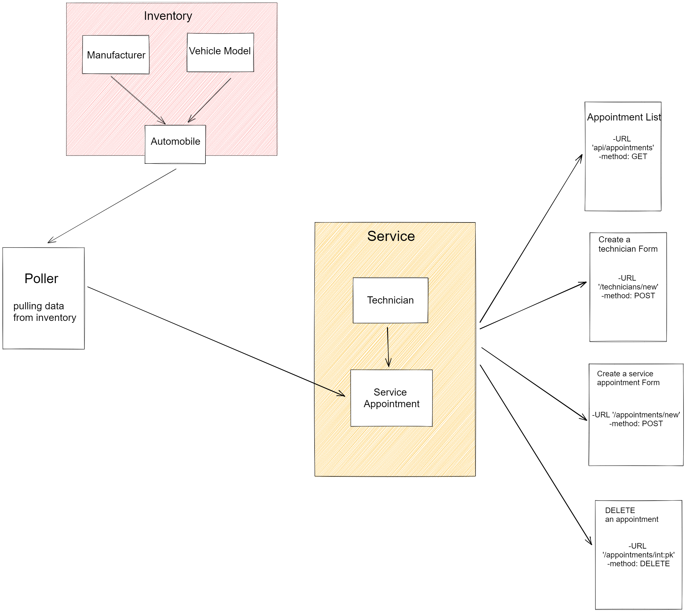
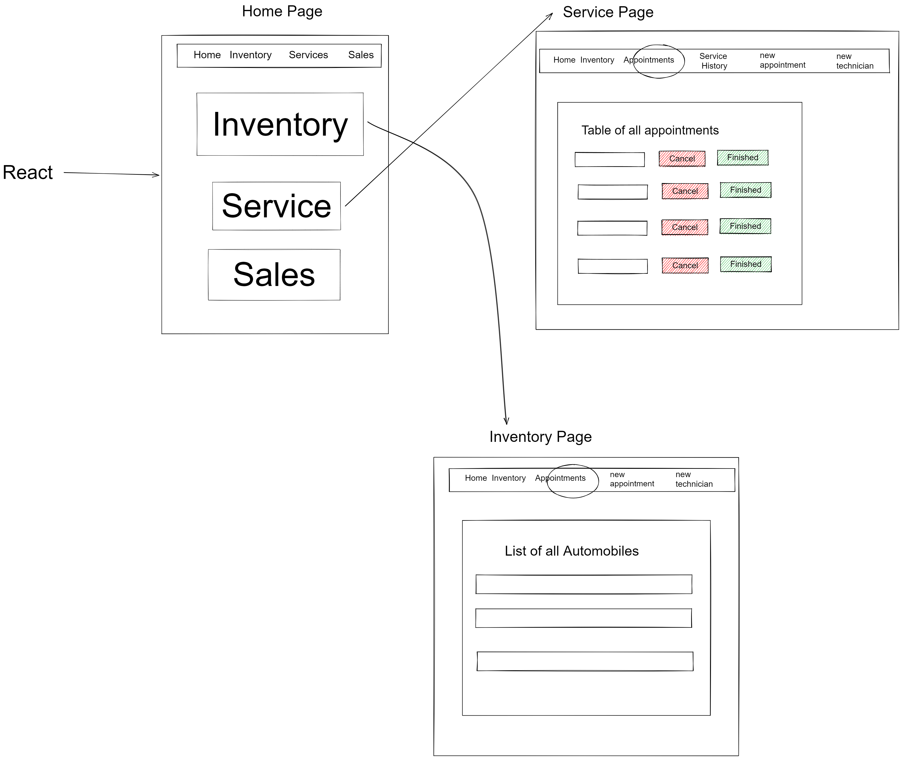
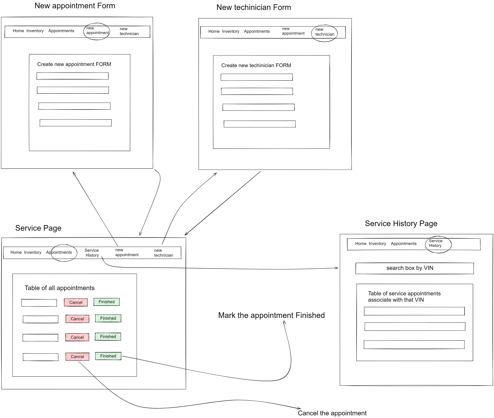

# CarCar
An application for managing aspects of an automobile dealership, specifically its inventory, service center, and sales.

Team:

* Tony Nguyen - Service microservice
* Mitchell Hom - Sales microservice

## Installation

1. Fork the repository at https://gitlab.com/Mhom35/project-beta
2. Select clone with HTTPS, and copy the link
3. Clone the repo using Terminal: `git clone repo-link`
4. Change your working directory to the new cloned repo: `cd repo-name`
5. Run the following commands:
    ```
    docker volume create beta-data
    docker-compose build
    docker-compose up
    ```
6. When you run docker-compose up and if you're on macOS, you will see a warning about an environment variable named OS being missing. You can safely ignore this
7. Read the project design and each microservices details below to understand how everything works
8. Once all your containers in Docker is up and running, go to http://localhost:3000/ to see the web app.
9. Use the navbar to navigate throughout the website
10. You can start adding some automobiles in your inventory by creating manufacturer, vehicle model, and automobile; then create the rest (customers, salesperson, technicians, etc.) as you go.

## Design


## Inventory microservice

Inventory API keep track of the automobile inventory for the automobile dealership.

* A Manufacturer have:
    - name
    - You can create a Manufacturer via the link "Inventory > Register Manufacturer" in navbar.

* A Vehicle Model have:
    - name
    - picture_url
    - manufacturer
    - You can create a Vehicle Model via the link "Inventory > Create Vehicle Model" in navbar.

* An Automobile have:
    - color
    - year
    - vin
    - model
    - You can create an Automobile via the link "Inventory > Add Automobile" in navbar.

* List of manufacturers:
    - show a list of manufacturers
    - You can access this via the link "Inventory > Manufacturers" in navbar.

* List of vehicle models:
    - show a list of vehicle models
    - You can access this via the link "Inventory > Vehicle Models" in navbar.

* List of automobiles:
    - show a list of automobiles in inventory
    - You can access this via the link "Inventory > Automobiles" in navbar.

## Service microservice





Service Api keep track of service appointments for automobiles and their owners.

* A technician have:
    - name
    - employee number
    - You can create a Technician via the link "Services > Add Technician" in navbar.

* A service appointment have:
    - VIN of the vehicle
    - name of the person to whom the vehicle belongs
    - the date and time of the appointment
    - the assigned technician
    - a reason for the service appointment
    - You can create an appointment via the link "Services > Create Appointment" in navbar.

* List of appointments:
    - show a list of scheduled appointments contain all the details (cancelled  - and finished appointment not shown)
    - If the VIN of an automobile was at one time in Inventory, that appointment will be marked for "VIP treatment"
    - Each appointment in the list have a button that allows a service concierge to cancel the appointment, or to show that the service appointment has been finished
    - You can access the list of appointments via the link "Services > Services List" in navbar.

* Service history:
    - show a list of service appointments for a specific VIN
    - You can access this via the link "Services > Service History" in navbar. Then enter a VIN into the search box to show list of service appointments for that VIN.

## Sales microservice


Sales microservice keeps track of customers, sales reps, and sales record


* Creation/list of a SalesRep
    - Requires input of name and a unique employeeID to create
    - Get request will send back name and employeeID
    - To access SalesRep information send a get request to "http://localhost:8090/api/sales_person/"

* Creation/list of Customers
    - Requires input of name, address, and phone_num (formatting is handled in the frontend)
    - Get request will list an array of objects that contains name, address, phone_num, and customer id
    - To access Customer information send a get request to "http://localhost:8090/api/customer/"

* List of Sales Record / Creation of Sales Record
    - Requires: An automobile(with associated vin) , customer, sales person to be made before creating a sales record
    - Creation of a sales record requires employeeID (coming from SalesPerson model), customer (customer id from customer model) and vin number(from AutoMobile VO that comes from our poller)
    - A record will send back price, id(of sales record), SalesPerson object model, automobile vin, customer name, and sales person name and employee ID (for ease of use)
    - To access sales record send a get request to "http://localhost:8090/api/sales"
